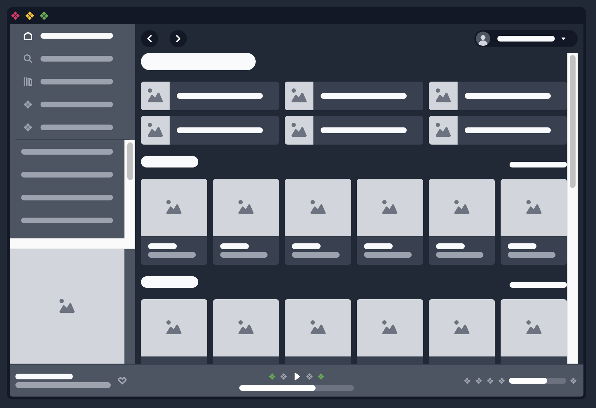

# Spotify – Lofi Design System



A small Storybook playground replicating parts of the Spotify UI to demo component structure, theming with Tailwind, and docs via MDX.

## Ressources

- [Conference talk on YouTube](https://www.youtube.com/watch?v=TmZxnZDpjaw)
- [Figma file](https://www.figma.com/design/uNfItH7AROAE9pf8RVHvtc/Spotify-%E2%80%93-Lofi-Design-System?m=auto&t=ttYvWlzgZcP8HTkR-6)

## Tech stack

- **React + TypeScript** (app + components)
- **Vite** (dev server & build)
- **Tailwind CSS** (styling)
- **Storybook** (component workshop + MDX docs)

Repo structure hints:

- `vite.config.ts`, `tailwind.config.js`, `postcss.config.js`, `.storybook/`, `src/`, `public/` are present in the repo file list.
- GitHub’s language stats show primarily TypeScript with some MDX.

## Getting started

### Prerequisites

- **Node 18+** recommended (compatible with modern Vite/Storybook)

### Install

Using **npm** (lockfile present):

```bash
npm ci
```

### Development

Run the app (Vite):

```bash
npm run dev
```

Run Storybook:

```bash
npm run storybook
```

Build Storybook (static export):

```bash
npm run build-storybook
```

> If your local `package.json` uses different script names, adjust the commands accordingly.

## Project layout

```
.
├─ .storybook/         # Storybook main/preview config, decorators, MDX setup
├─ public/             # Static assets
├─ src/                # Components, stories (*.mdx / *.stories.*), utils
├─ index.html          # Vite HTML entry
├─ tailwind.config.js  # Tailwind setup
├─ postcss.config.js   # PostCSS plugins
├─ vite.config.ts      # Vite config
└─ package.json
```

## Styling

- Tailwind is used for composable, utility‑first styling.
- Prefer inline utilities in stories; reserve `@apply` for small, repeated bundles.

## Accessibility

- Use semantic elements and ARIA where appropriate in stories.
- Test keyboard navigation within Storybook (Canvas + Docs).

## Scripts (suggested)

Add/confirm these in `package.json`:

```json
{
  "scripts": {
    "dev": "vite",
    "build": "vite build",
    "preview": "vite preview",
    "storybook": "storybook dev -p 6006",
    "build-storybook": "storybook build"
  }
}
```

## Roadmap ideas

- Component tokens & dark mode theming
- Interactive states & keyboard specs in stories
- Visual regression in CI (e.g., Chromatic)
- Deploy Storybook to a static host

## Credits

- Video inspiration: the YouTube link above (see header)
- Tooling: Storybook & Tailwind recipes from the official docs if needed later.
